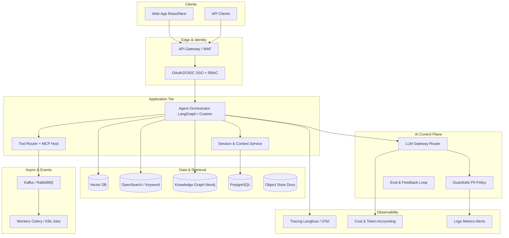
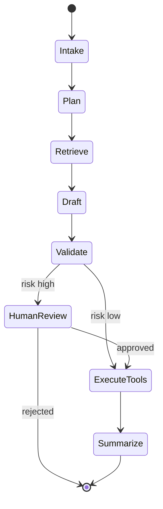
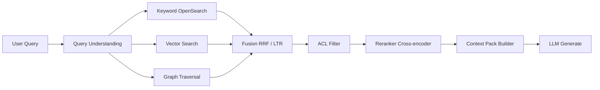
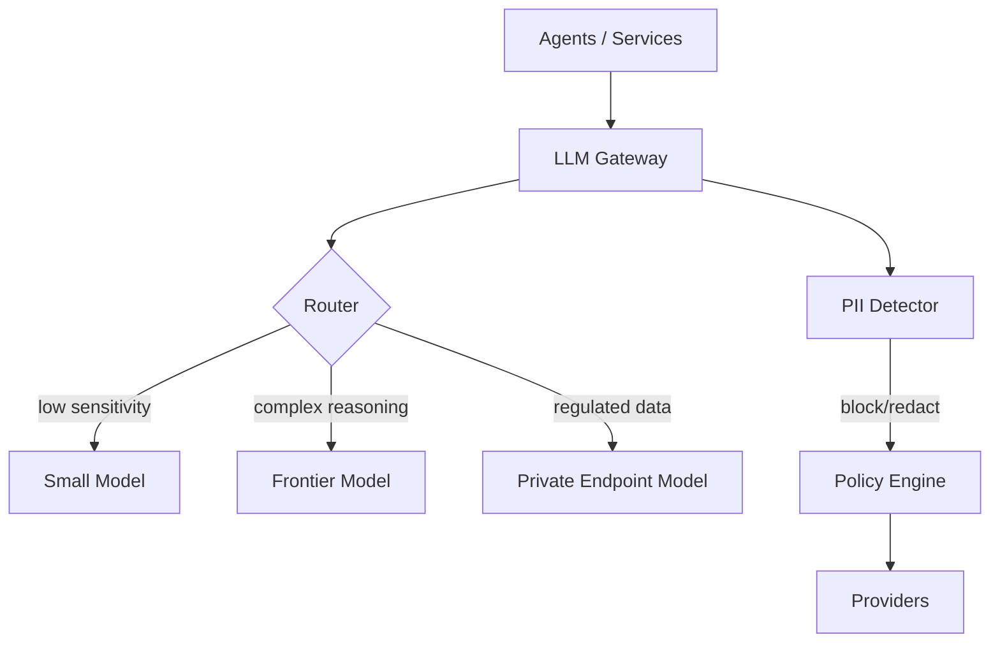
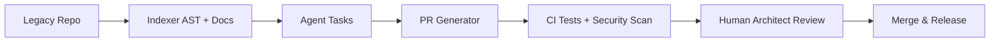

# Enterprise GenAI Solution Architect — Interview Preparation

> **Role:** Forward-deployed Enterprise GenAI Solution Architect (12+ years)  
> **Focus:** Multi-agent platforms, hybrid RAG, LLM gateways, context engineering, cloud-native delivery, enterprise security & governance, client-facing technical leadership  
> **How to use this doc:** Read each section as if you will **explain it to a C-suite sponsor and a principal engineer in the same room**. Lead with business outcome, then architecture, then trade-offs and failure modes.

**Related materials in this repo:** [COTDO answer framework](./technical-architect-interview-guide.md#1-how-to-structure-answers) · [Distributed systems & messaging depth](./technical-architect-interview-guide.md) · [Mock practice](./mock-interview-practice.md)

---

## Table of Contents

1. [Role map: what they are really hiring for](#1-role-map-what-they-are-really-hiring-for)
2. [Answer framework for this interview](#2-answer-framework-for-this-interview)
3. [Enterprise GenAI reference architecture](#3-enterprise-genai-reference-architecture)
4. [Multi-agent orchestration & workflow automation](#4-multi-agent-orchestration--workflow-automation)
5. [RAG at enterprise scale (hybrid retrieval)](#5-rag-at-enterprise-scale-hybrid-retrieval)
6. [Context engineering: memory, state, and context graphs](#6-context-engineering-memory-state-and-context-graphs)
7. [LLM gateway, routing, guardrails, and policy](#7-llm-gateway-routing-guardrails-and-policy)
8. [Observability, evaluation, cost, and quality](#8-observability-evaluation-cost-and-quality)
9. [Agent tools, MCP, and sandboxed execution](#9-agent-tools-mcp-and-sandboxed-execution)
10. [Security, identity, tenancy, and AI governance](#10-security-identity-tenancy-and-ai-governance)
11. [Distributed platform & full-stack integration](#11-distributed-platform--full-stack-integration)
12. [Cloud-native AI infrastructure (AWS, Azure, GCP)](#12-cloud-native-ai-infrastructure-aws-azure-gcp)
13. [Platform engineering: containers, IaC, CI/CD, MLOps](#13-platform-engineering-containers-iac-cicd-mlops)
14. [AI-assisted SDLC and code modernization](#14-ai-assisted-sdlc-and-code-modernization)
15. [Client engagement: POCs, ARBs, and executive narrative](#15-client-engagement-pocs-arbs-and-executive-narrative)
16. [System design prompts (practice out loud)](#16-system-design-prompts-practice-out-loud)
17. [Likely interview questions with architect-level talking points](#17-likely-interview-questions-with-architect-level-talking-points)
18. [Behavioral & leadership (forward-deployed)](#18-behavioral--leadership-forward-deployed)
19. [Study plan: Tuesday → Friday (your timeline)](#19-study-plan-tuesday--friday-your-timeline)
20. [Day-before one-pager](#20-day-before-one-pager)

---

## 1. Role map: what they are really hiring for

This is **not** a prompt-engineering job or a pure ML research role. It is a **forward-deployed platform architect** who:

| Dimension | What “good” looks like in the interview |
|-----------|-------------------------------------------|
| **Customer-facing** | Translates vague business goals into a **phased roadmap** (POC → pilot → production) with explicit risks and governance gates |
| **Hands-on** | Can whiteboard **agents + RAG + gateway + observability** and name the **services, data stores, and failure modes** |
| **Enterprise constraints** | RBAC, SSO, data residency, audit, PII/PHI, cost caps, model allowlists, human-in-the-loop |
| **Scale & reliability** | Async workflows, idempotent tools, retries, DLQs, rate limits, multi-tenant isolation |
| **Team leadership** | Sets **patterns** (orchestration, eval harness, ADRs), mentors engineers, runs ARBs |

**Minimum bar they will probe:** 2+ years **production** GenAI/agentic work — not demos only. Be ready with **one flagship story** (multi-agent or RAG platform) and **one hard incident** (hallucination, cost spike, data leak near-miss, or eval regression).

---

## 2. Answer framework for this interview

Use **COTDO** (Context → Options → Trade-offs → Decision → Outcome) from the [technical guide](./technical-architect-interview-guide.md#1-how-to-structure-answers). For GenAI, add **G**overnance and **E**valuation hooks:

| Step | GenAI-specific addition |
|------|-------------------------|
| **Context** | User persona, data sensitivity, latency SLO, budget per request, regulatory frame |
| **Options** | e.g. single-agent vs multi-agent; pure vector RAG vs hybrid; sync chat vs async jobs |
| **Trade-offs** | Quality vs cost vs latency vs explainability vs operational complexity |
| **Decision** | Reference **eval metrics**, **guardrails**, and **rollback** plan |
| **Outcome** | Quality metrics (faithfulness, task success), cost/request, incident rate, time-to-production |

**Executive layer (30 seconds):** “We reduced case handling time by X% while keeping human approval on high-risk actions and staying within $Y per 1K requests.”

**Engineering layer (60–90 seconds):** Orchestration graph, retrieval stack, gateway policies, observability spans.

---

## 3. Enterprise GenAI reference architecture

Use this as your **mental default** when asked “design an enterprise agent platform.”



### Layers explained (architect level)

| Layer | Responsibility | Typical failure if skipped |
|-------|----------------|----------------------------|
| **Identity & tenancy** | Who can invoke which agent, which tools, which data collections | Cross-tenant data leak; SOX audit failure |
| **Orchestrator** | Stateful workflows, branching, human approval, compensations | Fragile prompt chains; no recovery from tool errors |
| **LLM gateway** | Provider abstraction, routing, quotas, caching, logging | Vendor lock-in; runaway spend; inconsistent policy |
| **Retrieval** | Hybrid search + freshness + ACL-filtered chunks | Hallucinations; stale policy answers |
| **Tool execution** | MCP/API integrations with sandboxing | Prompt injection → arbitrary code or data exfiltration |
| **Observability** | Traces per agent step, eval scores, cost attribution | Cannot debug quality regressions or prove ROI |

---

## 4. Multi-agent orchestration & workflow automation

### Concepts you must articulate clearly

| Term | Architect definition |
|------|---------------------|
| **Agent** | LLM + policy + tools + memory, bounded by a role and permission set |
| **Orchestration** | Explicit control flow (graph/state machine), not one monolithic prompt |
| **Multi-agent** | Specialized agents with **handoffs**, shared or partitioned state, and supervision |
| **Autonomous execution** | Agent plans and acts in a loop until stop condition — requires **guardrails and budgets** |

### Framework landscape (how to compare without fanboyism)

| Framework | Strengths | Watch-outs |
|-----------|-----------|------------|
| **LangGraph** | First-class **state graphs**, checkpoints, human-in-the-loop, good for production workflows | You still own infra, eval, and tool security |
| **LangChain** | Broad integrations, rapid POC | Risk of spaghetti without strict layering |
| **CrewAI** | Role-based crews, fast demos | Less control for complex enterprise branching |
| **AutoGen** | Multi-agent conversation patterns | Operational maturity varies; strong sandbox needs |
| **Microsoft Agent Framework / SDK** | Azure-native identity, enterprise alignment | Often paired with Azure OpenAI + Entra ID |

**Architect decision rule:** Pick the framework that best maps to your **workflow model** (DAG vs conversational vs hierarchical supervisor). Standardize **cross-cutting concerns** outside the framework: gateway, authz, tracing, eval, tool registry.

### Orchestration patterns

1. **Supervisor + workers** — One planner routes to specialist agents (research, coding, compliance). Good when tasks are heterogeneous.
2. **Pipeline / DAG** — Fixed stages with gates (extract → retrieve → draft → validate → publish). Good for regulated content.
3. **Human-in-the-loop** — Pause graph at approval nodes; store checkpoint; resume with audit trail.
4. **Saga-style compensations** — If tool side effect partially succeeds, run compensating actions (release hold, reverse ticket).



### Sample spoken answer: “When do you use multi-agent vs single agent?”

> **Context:** Enterprise workflow with mixed steps — unstructured research, structured ERP updates, and compliance checks — under RBAC and audit requirements.  
> **Options:** Single agent with many tools; supervisor multi-agent; hard-coded microservices without LLM orchestration.  
> **Trade-offs:** Single agent simplifies ops but blurs prompts, over-invokes tools, and mixes compliance logic with creative steps. Pure microservices are reliable but miss flexible language reasoning. Multi-agent adds latency and debugging surface but **separates concerns** and lets you attach **different policies and models per agent**.  
> **Decision:** Supervisor + three specialists (Research, Action, Compliance) on LangGraph with checkpointing; compliance agent has **read-only** tools and blocks publish.  
> **Outcome:** Task success up, policy violations down; P95 latency increased ~20% — accepted because workflow is async for most users.

---

## 5. RAG at enterprise scale (hybrid retrieval)

### Why “vector-only RAG” fails in enterprises

- **Exact match needs:** SKUs, policy IDs, legal citations, error codes → **keyword/BM25** often beats pure embedding search.
- **Structured relationships:** “Which systems depend on API X?” → **knowledge graph** or metadata filters.
- **ACLs:** Retrieval must filter by **document-level permissions** before ranking.
- **Freshness:** HR/IT policies change — need **versioning**, incremental index, and TTL.

### Hybrid retrieval pipeline (reference)



| Stage | Purpose | Enterprise note |
|-------|---------|-----------------|
| **Chunking** | Balance recall vs context window | Structure-aware chunks (headings, tables); overlap; metadata |
| **Embedding model** | Semantic recall | Evaluate domain; consider dedicated embedding fine-tune |
| **Fusion** | Combine sparse + dense | Reciprocal Rank Fusion (RRF) is robust baseline |
| **Reranking** | Precision top-k | Extra latency/cost — use only on candidate set |
| **Context packing** | Token budget, citations | Attach source IDs for audit and UI highlights |

### Vector store selection (trade-off framing)

| Engine | When to favor | Caveats |
|--------|---------------|---------|
| **OpenSearch** | Already standard in enterprise; hybrid search | Ops skill for cluster sizing |
| **Pinecone** | Managed, fast POC to prod | Cost at scale; data residency options |
| **Milvus** | High-throughput vector | Self-managed complexity |
| **Weaviate / Chroma** | Dev velocity, modular | Enterprise features vary by deployment |

**Architect sound bite:** “We index **once**, serve **three retrieval paths** (keyword, vector, graph), fuse, ACL-filter, rerank, then cite sources in the UI.”

### RAG quality metrics (name these in interviews)

| Metric | What it measures |
|--------|------------------|
| **Context precision/recall** | Did we retrieve the right chunks? |
| **Faithfulness / groundedness** | Is the answer supported by retrieved text? |
| **Answer relevance** | Does it address the question? |
| **Citation accuracy** | Do links map to real spans? |

Use a **golden set** per domain (500–2000 Q&A with expected sources) and run in CI on prompt/model/index changes.

---

## 6. Context engineering: memory, state, and context graphs

**Context engineering** is the discipline of **what the model sees** at each step — not just “longer prompts.”

### Types of memory

| Type | Storage | Use case | Risk |
|------|---------|----------|------|
| **Working context** | Prompt window + tool outputs | Current task | Overflow → lost instructions |
| **Session memory** | Redis / PostgreSQL | Multi-turn chat | Stale facts; PII accumulation |
| **Long-term memory** | Vector + structured profile | Personalization | Wrong user linkage in multi-tenant |
| **Organizational memory** | RAG corpora + graph | Policies, runbooks | Outdated documents |

### State management in orchestrators

- **Checkpoint** graph state after each node (LangGraph pattern).
- **Idempotent nodes** so retries do not double-charge or duplicate tickets.
- **Separate “facts” from “instructions”** — system policy should not be overwritable by user chat.

### Context graphs

A **context graph** links entities (user, account, case, document, system) and relationships used to **expand retrieval** and **tool parameters**:

- User → belongs to → Business Unit → governed by → Policy P  
- Incident → affects → Service S → documented in → Runbook R  

Neo4j (or property graphs in other stores) supports **multi-hop reasoning** and **explainability** (“we used Policy P because BU = Finance”).

### Compression strategies (when window is insufficient)

1. **Rolling summarization** of older turns (with summarization eval).  
2. **Retrieve-only** — do not paste full history; fetch relevant past facts from store.  
3. **Structured state** — JSON schema for slots (customer_id, intent, open_tasks) instead of prose history.

---

## 7. LLM gateway, routing, guardrails, and policy

### LLM gateway responsibilities

| Function | Detail |
|----------|--------|
| **Multi-provider** | Azure OpenAI, Bedrock, Vertex, self-hosted — unified API |
| **Routing** | By task type, latency tier, data classification, cost |
| **Model tiering** | Small/fast for classification; large for synthesis |
| **Rate limiting & quotas** | Per tenant, per app, burst control |
| **Caching** | Semantic or exact cache for repeated FAQs (watch staleness) |
| **Logging** | Prompt/response redaction, retention policies |
| **Fallback** | Degrade model or return cached answer with disclaimer |



### Guardrails (defense in depth)

1. **Input:** PII detection, prompt injection heuristics + classifiers, jailbreak filters.  
2. **Tool:** Allowlist tools per role; parameter validation; max blast radius.  
3. **Output:** Schema validation (JSON mode), blocked topics, mandatory citations for factual domains.  
4. **Human:** Approval for financial transactions, access grants, external email.

**Architect point:** Guardrails are **policy-as-code** with versioning — not one regex in the app.

### Fine-tuning vs RAG vs prompt (decision table)

| Approach | Best when | Weak when |
|----------|-----------|-----------|
| **RAG** | Knowledge changes often; need citations | Style/format tightly controlled without post-processing |
| **Fine-tune** | Stable domain language, classification, extraction | Knowledge updates require retraining |
| **Prompt + tools** | Dynamic actions on systems | Long static knowledge in prompt |

Most enterprises: **RAG + tools + small fine-tuned models** for routing/extraction.

---

## 8. Observability, evaluation, cost, and quality

### Three pillars for agentic systems

| Pillar | What to trace | Tools (examples) |
|--------|---------------|------------------|
| **Tracing** | Each LLM call, tool call, retrieval step, latency | OpenTelemetry, Langfuse, Arize, Phoenix |
| **Evaluation** | Offline golden sets + online feedback | Ragas, custom harness, LLM-as-judge (with human calibration) |
| **FinOps** | Tokens, $/request, $/tenant, cache hit rate | Gateway metrics, cost allocation tags |

### Span model (what you draw on a whiteboard)

```
trace: agent_run_id
  ├─ span: retrieve (filters, k, latency)
  ├─ span: llm_plan (model, tokens, cost)
  ├─ span: tool_erp_update (status, idempotency_key)
  └─ span: llm_summarize
```

### Evaluation strategy (production-grade)

1. **Offline:** Block releases if faithfulness or task success drops > X% on golden set.  
2. **Online:** Thumbs up/down + implicit signals (user copied answer, ticket reopened).  
3. **Red team:** Scheduled adversarial tests for injection and data exfiltration.  
4. **Canary:** Route 5% traffic to new prompt/model; compare metrics.

### Cost controls architects recommend

- Token budgets per session and per agent step.  
- Cheaper model for **planning/classification**; expensive only for final answer.  
- Batch/async for non-interactive workloads.  
- Hard stop when daily tenant budget exceeded (graceful UX message).

---

## 9. Agent tools, MCP, and sandboxed execution

### Model Context Protocol (MCP)

**MCP** standardizes how agents discover and invoke **tools/resources** hosted by servers (filesystem, DB, SaaS, internal APIs).

| Concept | Meaning |
|---------|---------|
| **MCP host** | Your orchestrator/runtime that runs the agent loop |
| **MCP server** | Exposes tools with schema; enforces local auth |
| **Benefit** | Reusable integrations across agents; clearer boundary than ad-hoc JSON tools |

**Enterprise pattern:** Central **tool registry** with ownership, SLA, versioning, and security review — MCP servers registered per domain (CRM, ITSM, HR).

### Sandboxing agent-generated code

When agents write or execute code:

| Control | Implementation |
|---------|----------------|
| **Isolation** | gVisor, Firecracker microVMs, or ephemeral K8s jobs |
| **Network** | Egress allowlist only |
| **FS** | Read-only base image; temp writable dir |
| **Time/CPU** | Hard limits; kill on timeout |
| **Secrets** | Never in prompt; short-lived tokens injected by sidecar |

**Interview line:** “We treat the LLM as **untrusted input** to the execution plane.”

---

## 10. Security, identity, tenancy, and AI governance

### Identity stack

- **OAuth2 / OIDC** for users and service accounts.  
- **JWT** for stateless API auth — short TTL, rotation, audience claims.  
- **SSO** via Auth0, Keycloak, Entra ID — map IdP groups → **RBAC roles**.  
- **Multi-tenant isolation:** Separate data namespaces, encryption keys, and rate limits per tenant.

### Authorization for RAG and tools

- **Document ACLs** indexed with vectors (filter at query time).  
- **Tool scopes:** Role “Support Agent” cannot call `grant_admin`.  
- **Break-glass:** Logged, time-bound elevation.

### AI governance (what ARBs expect)

| Topic | Your stance |
|-------|-------------|
| **Data classification** | Which models/processes may touch restricted data |
| **Retention** | Prompt/response logs, eval sets, human review queues |
| **Model allowlist** | Approved providers and regions |
| **Human oversight** | When required by policy or risk score |
| **Explainability** | Citations, decision logs, graph paths |

### Threats specific to GenAI

| Threat | Mitigation |
|--------|------------|
| **Prompt injection** | Separate instructions/data; tool allowlists; output validation |
| **Indirect injection** | Sanitize retrieved web/docs; trust tiers |
| **Data exfiltration via tools** | Egress controls, DLP on outputs |
| **Model supply chain** | Pin versions; scan dependencies; private endpoints |

---

## 11. Distributed platform & full-stack integration

The JD expects you to connect **agent platforms** to **serious backend engineering**.

### Backend patterns

| Pattern | Use in GenAI platforms |
|---------|------------------------|
| **FastAPI / Node microservices** | Session API, admin, feedback, webhook ingest |
| **Kafka / RabbitMQ** | Long-running jobs, document ingestion, eval pipelines |
| **Celery + Redis** | Task queues for indexing, batch summarization |
| **PostgreSQL** | Users, tenants, conversations, audit, workflow state |
| **Redis** | Session cache, rate limits, distributed locks |

### Frontend (React / Next.js / Angular + TypeScript)

- Streaming UX (SSE/WebSockets) for token streaming.  
- Citation UI, feedback widgets, admin dashboards for eval/cost.  
- Role-based feature flags (which agents visible).

### API design for agents

- **Sync** `/chat` for low-latency Q&A with retrieval.  
- **Async** `/jobs` for multi-step automation with status polling/webhooks.  
- **Idempotency-Key** header on tool side effects.

Cross-reference: [Event-driven architecture](./technical-architect-interview-guide.md#5-event-driven-architecture-rabbitmq--kafka) and [Microservices on AWS](./technical-architect-interview-guide.md#3-microservices--cloud-native-aws) in the existing guide for deeper messaging and cloud diagrams.

---

## 12. Cloud-native AI infrastructure (AWS, Azure, GCP)

### Managed AI services (map by cloud)

| Capability | AWS | Azure | GCP |
|------------|-----|-------|-----|
| **Foundation models** | Bedrock | Azure OpenAI | Vertex AI Gemini |
| **Embeddings / custom** | Bedrock, SageMaker | Azure OpenAI, AI Foundry | Vertex |
| **Vector search** | OpenSearch, Kendra | AI Search | Vertex Vector Search |
| **Private networking** | VPC endpoints | Private Link | VPC-SC |
| **Secrets** | Secrets Manager | Key Vault | Secret Manager |

### Architecture principles

1. **Data stays in region** — models and indexes co-located with source systems.  
2. **Private endpoints** — no public internet for model calls in regulated workloads.  
3. **Separate accounts/subscriptions** per env (dev/test/prod) with IaC promotion.  
4. **GPU vs managed API** — default to **managed APIs** until unit economics force self-hosting.

### Example deployment topology (Kubernetes)

- **Ingress** → API gateway → orchestrator pods (HPA on CPU/latency).  
- **Workers** for ingestion/eval (KEDA on queue depth).  
- **GPU node pool** only if self-hosting models; else outbound to Bedrock/Azure/GCP APIs.

---

## 13. Platform engineering: containers, IaC, CI/CD, MLOps

| Practice | GenAI platform application |
|----------|----------------------------|
| **Docker** | Reproducible agent runtime, tool servers, eval runners |
| **Kubernetes** | Scale orchestrators and workers; network policies for sandbox |
| **Terraform / CDKTF** | Environments, IAM, OpenSearch, VPC, Bedrock access |
| **CI/CD** | Lint, unit tests, **eval gate** on golden set, staged deploy |
| **MLOps** | Prompt/version registry, model allowlist promotion, drift monitoring |

**Release artifact:** Not just container image — also **prompt hash**, **index version**, **eval report**.

---

## 14. AI-assisted SDLC and code modernization

The JD mentions **AI-assisted SDLC** and **automated code modernization** — expect scenario questions.

### Reference modernization pipeline



### Architect safeguards

- **Scope boundaries:** Module-by-module, not big-bang rewrite.  
- **Deterministic checks:** Tests, static analysis, contract tests — LLM proposes, **CI disproves**.  
- **Dependency extraction:** Graph of imports/services first; agents fill migration steps.  
- **Audit:** Every AI-generated PR tagged; retention for compliance.

**Talking point:** “AI accelerates **drafting**; engineering gates **correctness**.”

---

## 15. Client engagement: POCs, ARBs, and executive narrative

### POC success criteria (define upfront)

| Dimension | Example metric |
|-----------|----------------|
| **Business** | Time saved, deflection rate, revenue impact |
| **Quality** | Task success ≥ X%, faithfulness ≥ Y |
| **Risk** | Zero P1 security findings; human review on edge cases |
| **Ops** | Deployable on client SSO; logging acceptable to InfoSec |

### Running parallel POCs

- **Platform team** owns gateway, observability, golden path templates.  
- **POC pods** own domain prompts, corpora, eval sets — **no snowflake infra**.  
- Weekly **ARB** cadence: architecture decisions recorded as ADRs.

### Executive storyline template

1. **Problem** — cost, speed, risk in current process.  
2. **Option** — automation with human oversight, not “replace everyone.”  
3. **Phases** — POC (4–6 weeks) → pilot (one BU) → scale.  
4. **Investment** — platform once, domains many.  
5. **Risk & mitigation** — governance, eval, rollback.

---

## 16. System design prompts (practice out loud)

Practice **45 minutes each** — ask clarifying questions first.

### Design A — Enterprise copilot with hybrid RAG

**Prompt:** “Design a copilot for 50K employees over HR + IT policies, SSO, citations required, ≤8s P95 for answers.”

**Must mention:** ACL-aware retrieval, hybrid search, gateway routing, eval set, audit logs, cost caps.

### Design B — Multi-agent IT workflow automation

**Prompt:** “Agent resolves L1 tickets: classify, search KB, propose resolution, optional ServiceNow update with approval.”

**Must mention:** LangGraph-style states, tool RBAC, human approval, idempotent ITSM API, observability spans.

### Design C — LLM gateway for multi-tenant SaaS

**Prompt:** “Single product, 200 tenants, mixed data sensitivity, multiple model providers.”

**Must mention:** Router rules, private vs shared models, quota, redaction, tenant billing, fallback.

### Design D — Document ingestion at scale

**Prompt:** “Ingest 10M PDFs/SharePoint docs, daily deltas, near-real-time search.”

**Must mention:** Kafka pipeline, parsing/OCR, chunking, embedding batching, index versioning, replay.

---

## 17. Likely interview questions with architect-level talking points

### GenAI & agents

| Question | Core of a strong answer |
|----------|-------------------------|
| How do you prevent hallucinations in production? | Hybrid RAG, rerank, faithfulness eval, citations, abstain when low confidence, human review |
| Single agent vs multi-agent? | Separation of concerns vs latency/complexity; supervisor for heterogeneous workflows |
| How do you debug a bad answer? | Trace retrieval chunks, model/version, prompt hash, tool outputs; replay in staging |
| LangGraph vs CrewAI? | Graph/state/checkpoints vs role crews; enterprise needs checkpoint + HITL |

### RAG & data

| Question | Core of a strong answer |
|----------|-------------------------|
| Chunking strategy? | Structure-aware, metadata, overlap; eval-driven tuning |
| OpenSearch vs vector DB? | Hybrid in OpenSearch vs dedicated vector — cost, ops, latency |
| Knowledge graph role? | Multi-hop, explainability, linking entities — not replacement for text RAG |
| Freshness? | Incremental index, versioning, TTL, source-of-truth webhook |

### Platform & security

| Question | Core of a strong answer |
|----------|-------------------------|
| Prompt injection defense? | Layers: input scan, retrieval trust tiers, tool allowlist, sandbox, output validation |
| Multi-tenant isolation? | Namespace, keys, ACL filters, network policies, separate indexes or strict filters |
| MCP in enterprise? | Tool registry, reviewed servers, auth at server, audit |
| Cost explosion scenario? | Rate limits, budgets, alerts, model tiering, cache, kill switch |

### Cloud & delivery

| Question | Core of a strong answer |
|----------|-------------------------|
| Bedrock vs Azure OpenAI vs Vertex? | Client constraints, data residency, existing cloud, feature parity, pricing |
| Why Kubernetes for agents? | Scale workers, sandbox jobs, standard deploy — not always needed for pure API POC |
| CI/CD for prompts? | Version control, eval gates, canary, rollback |

---

## 18. Behavioral & leadership (forward-deployed)

Prepare **2 STAR stories** (60s and 2min versions):

1. **Flagship delivery** — Enterprise GenAI/agent/RAG from POC to production.  
2. **Crisis or near-miss** — Quality regression, cost spike, security finding, failed POC pivot.

### Themes they assess

| Theme | Example angle |
|-------|----------------|
| **Ownership** | You stayed through production hardening, not just demo |
| **Influence without authority** | Won InfoSec buy-in for logging redaction design |
| **Mentorship** | Standardized orchestration pattern; reduced POC infra duplication |
| **Ambiguity** | Client changed goal mid-POC — reframed success criteria |

### Questions to ask them (shows architect maturity)

- How do you separate **platform engineering** from **forward-deployed pods**?  
- What is your **eval and release gate** for prompts/models today?  
- Biggest **governance blocker** in recent enterprise deals?  
- Mix of **AWS vs Azure vs GCP** in the next 12 months?

---

## 19. Study plan: Tuesday → Friday (your timeline)

Assume interview **Friday** — adjust if your date differs.

| Day | Focus (90–120 min) | Deliverable |
|-----|---------------------|-------------|
| **Tue** | §3 reference arch + §4 multi-agent + §5 RAG | Draw architecture from memory; one COTDO answer on multi-agent |
| **Wed** | §6 context + §7 gateway + §8 observability | Whiteboard LLM gateway; list 5 eval metrics with definitions |
| **Thu** | §9 MCP/sandbox + §10 security + §16 Design A & B spoken | 45-min mock: Design B out loud; one STAR story timed |
| **Fri AM** | §20 one-pager + §17 rapid fire | 15-min review only; no new topics |

**Daily habit:** 30 min read + **30 min spoken** (record audio) + 15 min self-quiz from §17.

Optional: one [mock round](./mock-interview-practice.md) adapted — replace ticket booking with **Design B**.

---

## 20. Day-before one-pager

Memorize this skeleton:

1. **My headline:** Forward-deployed architect — **agents + hybrid RAG + gateway + governance**.  
2. **Reference diagram:** Clients → IAM → Orchestrator → Gateway → Models; sidecars for retrieval, tools/MCP, Kafka workers, observability.  
3. **Three non-negotiables:** ACL-aware retrieval, tool RBAC + sandbox, eval/cost gates in CI.  
4. **Flagship story:** Problem → architecture → metric → what I’d improve.  
5. **Trade-off I always mention:** Quality vs latency vs cost — pick two per use case.  
6. **Close strong:** Phased roadmap, human oversight, measurable ROI.

---

## Appendix — Quick glossary

| Term | One-line |
|------|----------|
| **RRF** | Rank fusion for hybrid search |
| **HITL** | Human-in-the-loop approval nodes |
| **Grounding** | Answer tied to retrieved evidence |
| **Agent checkpoint** | Persisted graph state for retry/resume |
| **Private endpoint** | Model traffic without public internet |
| **Idempotent tool** | Same key → same effect once |

---

*Good luck on Friday. Lead with trade-offs, cite metrics, and show you can go from boardroom roadmap to Kubernetes namespace in one conversation.*
